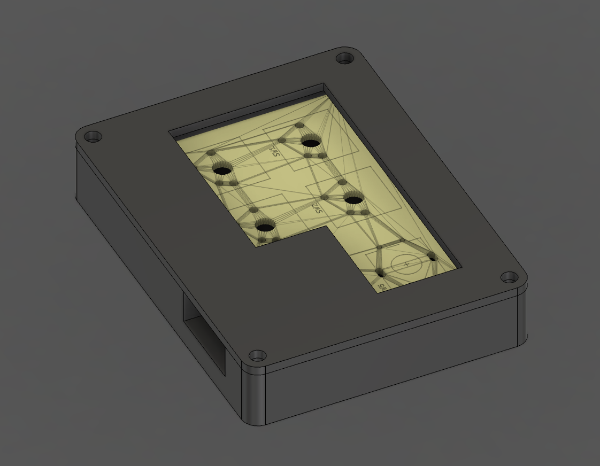
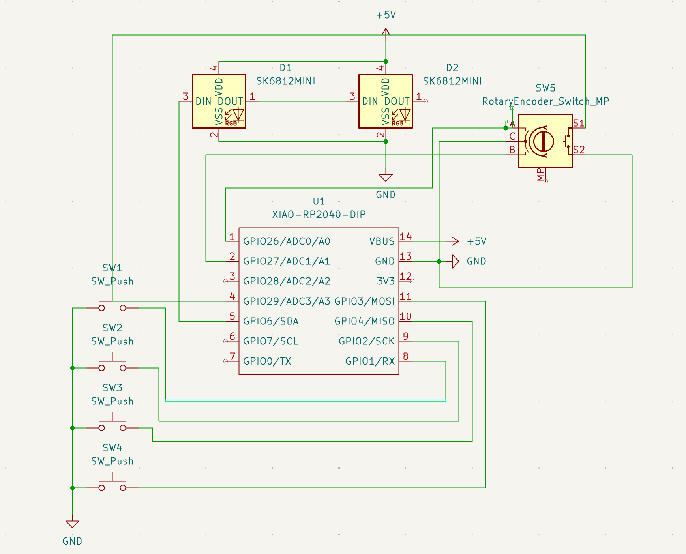
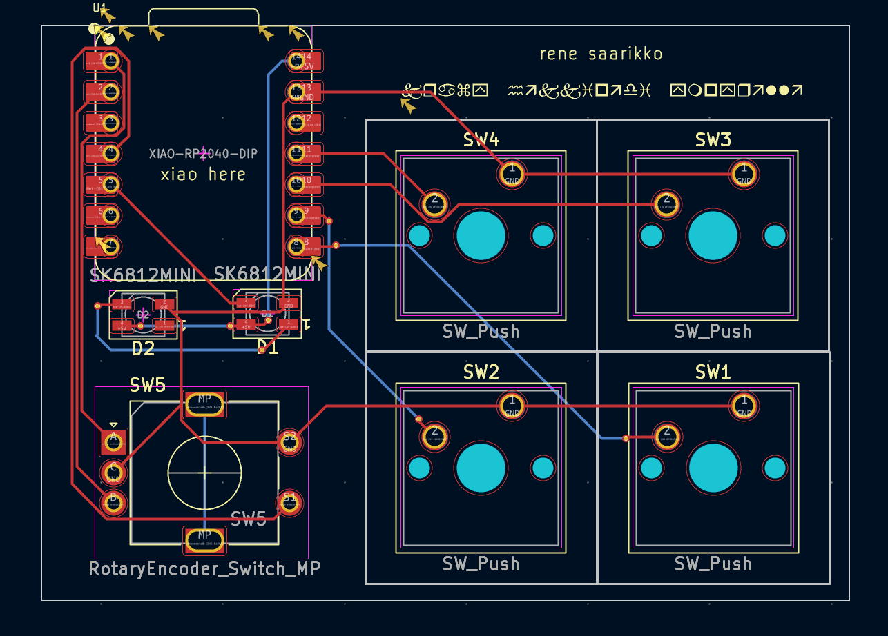

## Bill of Materials

| Reference | Qty | Value | Footprint | Datasheet | JLCPCB Link |
|-----------|-----|-------|-----------|-----------|-------------|
| D1, D2 | 2 | SK6812MINI | LED_SMD:LED_SK6812MINI_PLCC4_3.5x3.5mm_P1.75mm | [SK6812MINI Datasheet](https://cdn-shop.adafruit.com/product-files/2686/SK6812MINI_REV.01-1-2.pdf) | [C2886570](https://jlcpcb.com/partdetail/OpscoOptoelectronics-SK6812mini/C2886570) |
| SW1, SW2, SW3, SW4 | 4 | SW_Push | Button_Switch_Keyboard:SW_Cherry_MX_1.00u_PCB | ~ | [C5687012](https://api.jlcpcb.com/partdetail/CHERRY-MX1A11NN/C5687012) |
| SW5 | 1 | RotaryEncoder_Switch_MP | Rotary_Encoder:RotaryEncoder_Alps_EC11E-Switch_Vertical_H20mm | ~ | [C2687288](https://jlcpcb.com/partdetail/ALPSALPINE-EC11E1544407/C2687288) |
| U1 | 1 | XIAO-RP2040-DIP | OPL:XIAO-RP2040-DIP | | [C2040](https://jlcpcb.com/partdetail/RaspberryPi-RP2040/C2040) |
